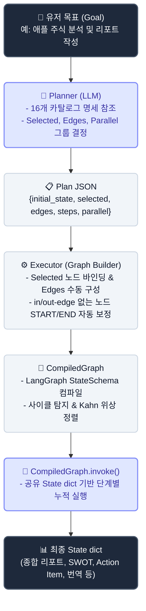
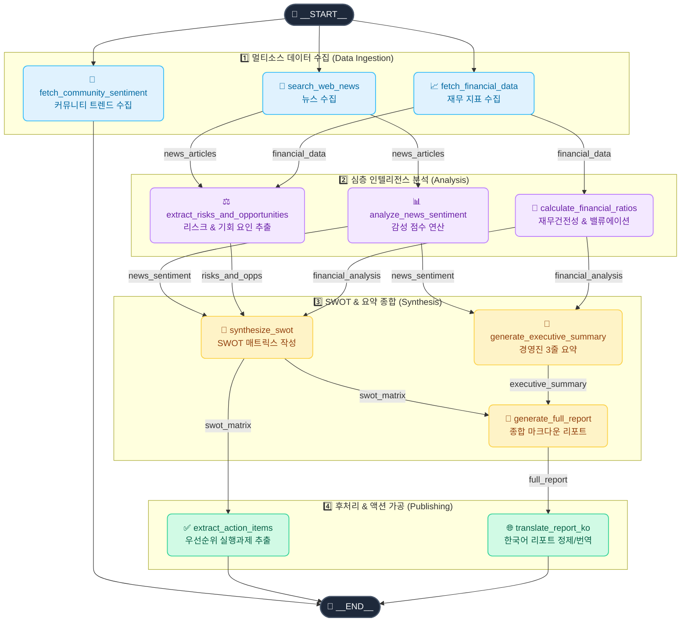

# flow-gen

Dynamic Multi-Stage Deep Research & Analytics DAG Orchestrator.

**설계:**
- 노드는 [`nodes.py`](src/dag_langgraph/nodes.py) 레지스트리에 **독립적 효용성을 갖춘 16개 모듈**로 정의됨 (이름 + 상세 명세 + 구현)
- Planner(LLM)는 카탈로그 설명만 보고 필요한 **노드 선택** + **다단계 의존성 엣지 및 병렬 그룹 결정**
- 노드 구현/params 는 Planner가 건드리지 않는다
- 데이터 흐름: 공유 `state` dict (LangGraph StateSchema 병합 래퍼 기반). 각 노드 `fn(state) -> state_update`.

---

## 1. 아키텍처 & 실행 흐름



---

## 2. 대표 DAG 파이프라인 다이어그램 (11-Node Enterprise Intelligence Flow)

유저가 `"애플 주식 분석 및 최근 뉴스 리포트 작성해줘"`를 입력했을 때 동적으로 생성되어 실행되는 다단계 DAG 파이프라인 구조입니다.



---

## 3. 파일 구조

```
.
├── pyproject.toml
├── src/dag_langgraph/
│   ├── __init__.py
│   ├── nodes.py        # 16개 고효용성 노드 카탈로그 (수집 -> 분석 -> 종합 -> 후처리)
│   ├── graph.py        # LangGraph 백엔드 빌더 (StateSchema reducer 기반 병렬 실행 지원)
│   ├── planner.py      # LLM → Plan (다단계 의존성 & 병렬 플랜 생성, stub fallback)
│   ├── executor.py     # Plan → Graph 변환 + run 파사드
│   └── cli.py          # `flow-gen` CLI 엔트리포인트
└── tests/
    ├── test_graph.py
    ├── test_nodes.py
    ├── test_planner.py
    └── test_executor.py
```

---

## 4. Setup

```bash
uv sync --extra dev
cp .env.example .env        # ANTHROPIC_API_KEY (선택, 없으면 stub)
```

---

## 5. Run

```bash
# 애플 기업/주식 분석 DAG 파이프라인 (11개 노드 4단계 파이프라인 생성)
uv run flow-gen "애플 주식 분석 및 최근 뉴스 리포트 작성해줘"

# AI 기술 논문 & 트렌드 DAG 파이프라인
uv run flow-gen "최신 AI 기술 논문 및 트렌드 조사해줘"

# 노드 카탈로그 확인
uv run flow-gen --list-nodes

# Verbose 모드 (단계별 state 변화 확인)
uv run flow-gen -v "종합 리서치 보고서 생성해줘"
```

---

## 6. Test

```bash
uv run pytest
uv run pytest --cov=src --cov-report=term-missing
```

---

## 7. Graph API 직접 사용 (노드 직접 바인딩)

```python
from dag_langgraph import Graph, START, END, NODES

g = Graph()
g.add_node("search_web_news", NODES["search_web_news"].fn)
g.add_node("analyze_news_sentiment", NODES["analyze_news_sentiment"].fn)
g.set_entry_point("search_web_news")
g.add_edge("search_web_news", "analyze_news_sentiment")
g.set_finish_point("analyze_news_sentiment")

state = g.compile().invoke(initial_state={"ticker": "AAPL"})
```

---

## 8. 새 노드 추가

[`src/dag_langgraph/nodes.py`](src/dag_langgraph/nodes.py) 의 `_REGISTRY` 에 `Node(name, description, fn)` 추가.
설명에 **읽는 state 키** + **쓰는 state 키** 명시. Planner 는 이 설명만으로 연결 가능성을 판단한다.

---

## 9. 설계 포인트

| 개념 | 위치 |
|---|---|
| 사전 정의된 16개 노드 | [`nodes.NODES`](src/dag_langgraph/nodes.py) (카탈로그 + 설명) |
| Planner 역할 제한 | 선택 + 엣지 + 병렬 그룹만. 구현/params 불가 |
| Pydantic 스키마 강제 | [`planner.Plan`](src/dag_langgraph/planner.py) |
| Builder API & 병렬 State Reducer | [`graph.Graph`](src/dag_langgraph/graph.py) |
| 사이클 탐지 + 위상정렬 (Kahn) | `graph.Graph._topo_order` |
| 공유 state 데이터 흐름 | `graph.CompiledGraph.invoke` |
| Plan → Graph 변환 | `executor.build` |
| Stub fallback | `planner._stub_plan` |
